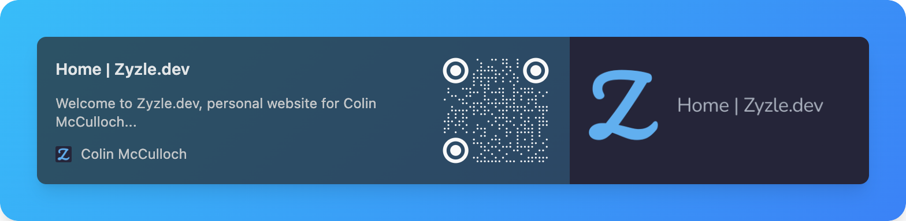

# Welcome to my profile

Thanks for checking out my profile, if you want to know more have a look at the pinned repos or visit my blog linked below.

<!-- img alt="profile pic" src="profile.png" height="300px" width="300px" / -->

## My current projects you should check out

## My github stats

<!-- |                                                                Stats                                                                 |                                                                              Languages                                                                              |
| :----------------------------------------------------------------------------------------------------------------------------------: | :-----------------------------------------------------------------------------------------------------------------------------------------------------------------: | -->

 

   

<!--
**Zyzle/Zyzle** is a ✨ _special_ ✨ repository because its `README.md` (this file) appears on your GitHub profile.

Here are some ideas to get you started:

- 🔭 I’m currently working on ...
- 🌱 I’m currently learning ...
- 👯 I’m looking to collaborate on ...
- 🤔 I’m looking for help with ...
- 💬 Ask me about ...
- 📫 How to reach me: ...
- 😄 Pronouns: ...
- ⚡ Fun fact: ...
-->
